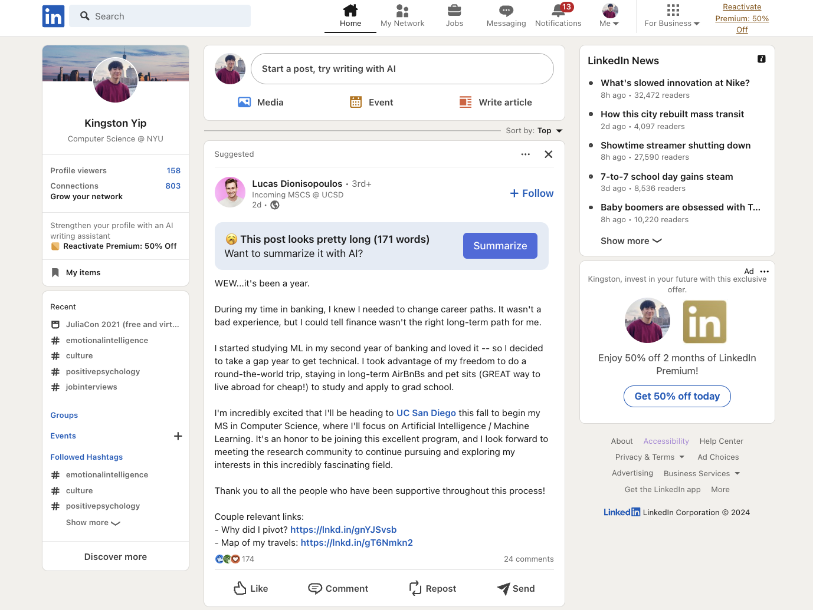

# LinkedIn TLDR TypeScript Chrome Extension


## Setup
This project uses [Vite](https://vitejs.dev/) and [crxjs](https://crxjs.dev/vite-plugin) to build the extension.

### Clone repository
```sh
git clone https://github.com/kingsotn/LinkedIn-TLDR.git
```

### Install dependencies

```sh
yarn
```

### Build extension

```
yarn watch

# or

yarn build
```

### Load extension

1. Navigate to [chrome://extensions/](chrome://extensions/)
1. Turn on the "Developer mode" toggle switch in the top right of the window
1. Click the "Load unpacked" button in top left of the window

## [Popup](https://developer.chrome.com/docs/extensions/mv3/user_interface/#popup)

The popup source code is at the root directory.

## [Content Script](https://developer.chrome.com/docs/extensions/mv3/content_scripts/)

The content script source code is in the `content-script` directory.
